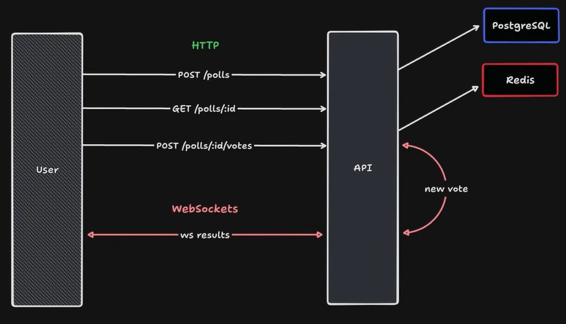

<h1 align="center">
  Real-time Polls
</h1>

<p align="center">
  

  

  <a href="https://github.com/dsbastos/nlw-expert-node">
    
  </a>

   
   <a href="https://github.com/dsbastos/nlw-expert-node/stargazers">
  </a>

  <a href="https://www.linkedin.com/in/daniel-bastos98/">
    
  </a>
</p>

<h4 align="center">
  Status: Finished
</h4>

<p align="center">
About •
Features •
Tech •
How to test? •
Author
</p>

<h1 align="center">
    
</h1>

## 💻 About

This project was developed as a result of Rocketseat's Next Level Week (NLW) program.

This is a voting system that allows users to create polls and vote in real time using the Fastify (Node.js framework) and TypeScript.

Prisma is a ORM that consists of auto-generated and type-safe query builder for Node.js & TypeScript. PostgreSQL stored the polls and his respective options.

Redis was use to make webSocket real-time vote updates and ranking of the available options.

## 🛠️ Tech

The following tools were used in the construction of the project:

- **[Node.js](https://nodejs.org)**
- **[Typescript](https://www.typescriptlang.org/)**
- **[Fastify](https://fastify.dev/)**
- **[Docker](https://www.docker.com/)**
- **[PostgreSQL](https://www.postgresql.org/)**
- **[Redis](https://redis.io/)**
- **[Postman](https://www.postman.com/)**

## 🤔 How to test?

### Create a poll

1. **Method:** POST
2. **URL:** <http://localhost:3333/polls>
3. **Request Body:** JSON format:

```json
{
  "title": "What's the best Node.js framework?",
  "options": ["Express", "Fastily", "NestJs", "HapiJs"]
}
```

4. **Response Body:** It will return the poll id you create:

```json
{
  "pollID": "7ea7d20c-6766-4296-8b46-b3075f9891ae"
}
```

### View specific poll by id

1. **Method:** GET
2. **URL:** <http://localhost:3333/tasks/:pollId> (Replace `:pollId` with the poll id)
3. **Response Body:** It will return a specific poll with their options. Options has an id, a title and his respective score :

```json
{
  "poll": {
    "id": "7ea7d20c-6766-4296-8b46-b3075f9891ae",
    "title": "What's the best Node.js framework?",
    "options": [
      {
        "id": "cb65517d-e806-4698-a42c-8abe1121e428",
        "title": "Express.js",
        "score": 0
      },
      {
        "id": "e3f81a48-6f37-4928-bd37-14cc84afba54",
        "title": "Fastily",
        "score": 0
      },
      {
        "id": "c38b83d6-8142-45ce-8de9-2a8362ca43f5",
        "title": "NestJs",
        "score": 0
      },
      {
        "id": "00e6f0a3-ff0c-4191-b30a-3ef3fab81100",
        "title": "HapiJs",
        "score": 0
      }
    ]
  }
}
```

### Vote on poll

1. **Method:** POST
2. **URL:** <http://localhost:3333/polls/:pollId/votes> (Replace `:pollId` with the poll id)
3. **Request Body:** JSON format:

```json
{
  "pollOptionId": "a04d9e39-122a-4dc6-8612-1e3d5ed82436"
}
```

### Use Websockets

1. **URL:** <ws://localhost:3333/polls/:pollId/results> (Replace `:pollId` with the poll id)
2. **Response Body:** It will return all poll's votes it was change, just like that ⬇️

```json
{ "pollOptionId": "cb65517d-e806-4698-a42c-8abe1121e428", "votes": 1 }
```

## 👨🏻‍💻 Getting Started

1 - Clone the git clone repository <https://github.com/DsBastos/nlw-expert-node>

2 - Run `npm i` to install the dependencies

3 - Run Docker Compose to initialize the databases: `docker-compose up -d`

4 - To construct the tables in PostgreSQL, execute the Prisma migrations: `npx prisma migrate dev`

5 - run the server: `npm run dev`

## 🙂 Author

<a href="https://www.linkedin.com/in/daniel-bastos98/">

</a>

[](https://www.linkedin.com/in/daniel-bastos98/)
